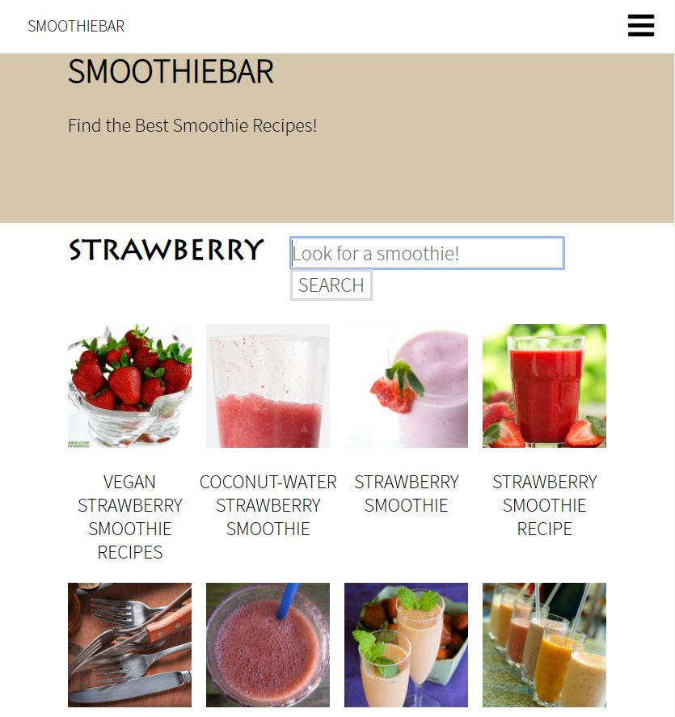
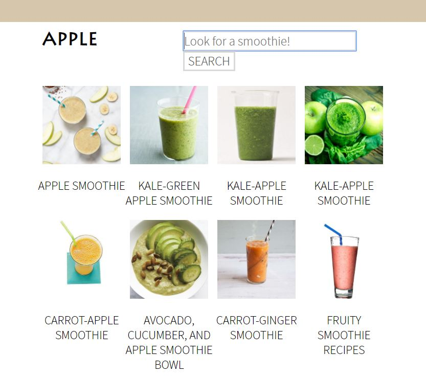

# SmoothieBar

Smoothiebar website is developed to find all kinds of smoothie recipes. 
The website includes a smoothie recipe search option, which works by using an Edamam Recipe Search API integration.
Smoothie recipes can be filtered by ingredients, diet or allergy restrictions.

## Edamam Recipe Search API integration
Edamam Recipe Search API is integrated to the website by using the Fetch API. 
The Fetch API provides an interface for accessing and manipulating resources.  
The fetch() method takes the path to the resource you want to fetch and returns a promise containing the response.
The json() method gets the JSON body content from the response. 
Edamam Recipe Search API provides recipes submitted in JSON format according to the specific api documentation.

## Smoothiebar website images

